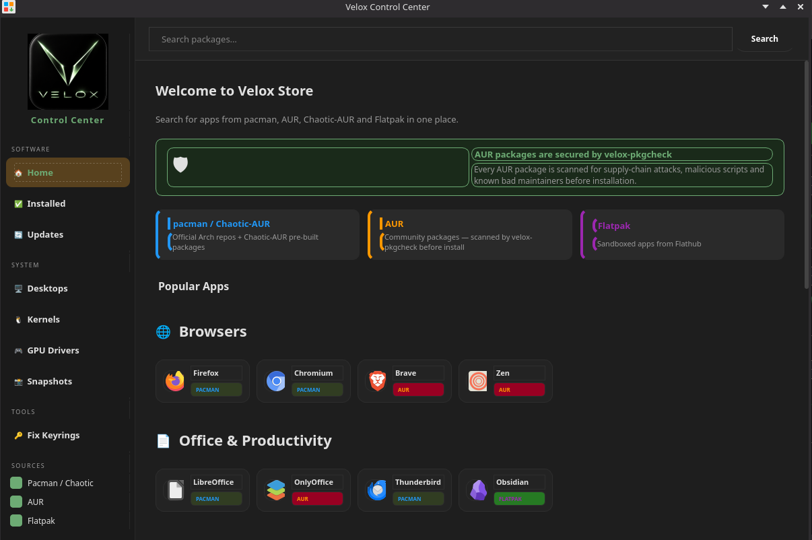
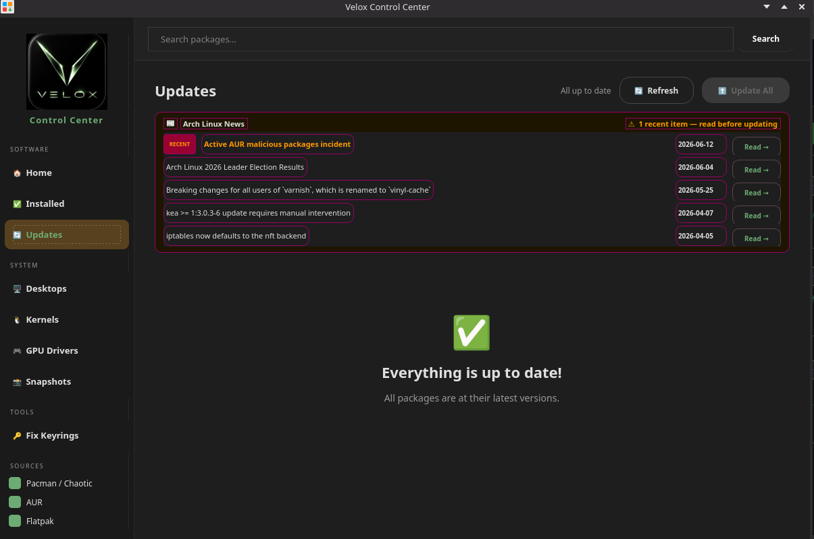
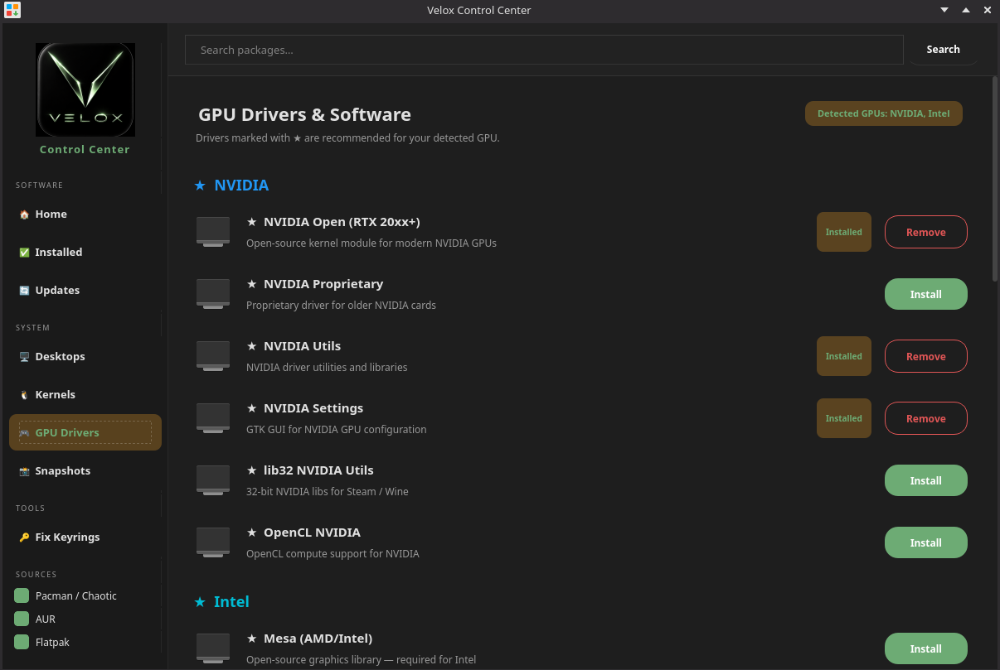

# Velox Linux

<div align="center">

**Shape It. Race It. Own It.**

[](https://github.com/thelinutubetltos/velox-iso)
[](https://youtube.com/@thelinuxtube)
[](https://sourceforge.net/projects/velox-linux/)
[](https://thelinutubetltos.github.io/velox_repo)

</div>

---

## What is Velox Linux?

Velox Linux is an **Arch Linux-based KDE Plasma distribution** built for creators, gamers, and power users who want a fast, beautiful, and fully-featured system right out of the box.

> **Velox** (Latin) — *swift, fast, rapid*

---

## Velox Control Center

The heart of Velox Linux — a single app for everything.







- **Install apps** — search pacman, Chaotic-AUR, AUR, and Flatpak in one place
- **GPU Drivers** — install NVIDIA, AMD, and Intel drivers with one click
- **Kernels** — switch between linux-velox, linux, linux-lts, linux-zen, linux-hardened, and linux-rt
- **Desktop Environments** — add GNOME, XFCE, Cinnamon, Hyprland, and more alongside KDE
- **BTRFS Snapshots** — manage Snapper snapshots with a GUI
- **One-click System Updates** — pacman + Flatpak in one button
- **Arch Linux News Feed** — live feed from archlinux.org shown before every update, with recent items flagged so you never miss a required manual step
- **AUR Security Scanner** — every AUR package is scanned by `velox-pkgcheck` before installation
- **Fix Keyrings** — one-click keyring repair when pacman GPG errors occur

---

## What's Included

### Desktop Environment
- **KDE Plasma 6** — modern, powerful, and fully customized
- **Kvantum** dark theme with Velox green accents
- **Custom wallpapers** — Velox-1 through Velox-15, dark atmospheric art
- **Custom SDDM login theme** — Velox branded with wallpaper background
- **KDE lock screen** — Velox wallpaper set via skel

### Software
- **Firefox** — browser pre-installed
- **Kdenlive** + **OBS Studio** + **GIMP** + **Inkscape** + **Krita** — creative tools
- **VLC** — media player
- **qBittorrent** — torrent client
- **Visual Studio Code** + **Sublime Text** — code editors
- **Fastfetch** — custom Velox-branded system info (VL monogram logo)
- **Paru** + **Yay** — AUR helpers pre-installed
- **Flatpak** — pre-installed and ready

### Performance
- **linux-velox** — custom performance-tuned kernel based on CachyOS
- **CPU governor locked to `performance`** on boot — faster response, better benchmark scores
- **Ananicy-cpp** + **CachyOS rules** — automatic process priority management
- **Zram** — compressed RAM swap for better performance
- **irqbalance** — optimized interrupt handling
- **hblock** — ad and malware blocking at the system level
- **ParallelDownloads = 25** — faster package installs out of the box

### System Tools
- **Calamares installer** — fully themed with Velox branding, wallpaper slideshow, and dark UI
- **Gparted** + **KDE Partition Manager** — disk management
- **Hardinfo2** + **hw-probe** — hardware diagnostics
- **Btop** + **Resources** + **Glances** — system monitoring
- **Snapper** support — BTRFS snapshots via Velox Control Center

### Gaming Ready
- **Steam** pre-configured
- **Lutris** + **Heroic** + **Bottles** — game launchers
- **MangoHud** — in-game performance overlay
- **NVIDIA drivers** installed automatically post-install on NVIDIA hardware
- **AMD** driver support via mesa (included)

---

## NVIDIA Driver Handling

Velox does **not** bundle NVIDIA proprietary drivers in the live ISO. Instead:

- The **live environment** runs on open source mesa/nouveau drivers
- During installation, Calamares **auto-detects your GPU** via `lspci`
- If an NVIDIA GPU is found, `nvidia-open-dkms`, `nvidia-utils`, and `nvidia-settings` are installed automatically into the installed system
- NVIDIA GRUB boot entries are only added when NVIDIA hardware is detected

This keeps the ISO lean and avoids carrying DKMS-compiled modules for hardware that may not be present.

---

## Custom Repositories

**velox_repo** — small packages hosted on GitHub Pages:
```ini
[velox_repo]
SigLevel = Never
Server = https://thelinutubetltos.github.io/velox_repo/$arch
```

**velox-packages** — large packages (kernel, calamares) hosted on GitHub Releases:
```ini
[velox-packages]
SigLevel = Never
Server = https://github.com/thelinutubetltos/velox_repo/releases/download/velox-packages
```

---

## Boot Options

After installation, the GRUB menu includes:
- **Velox Linux** — default boot
- **Velox Linux - NVIDIA (proprietary)** — only on NVIDIA hardware
- **Velox Linux - NVIDIA (open source)** — only on NVIDIA hardware
- **Velox Linux - AMD** — AMD GPU optimized
- **Velox Linux (fallback)** — fallback initramfs

---

## Roadmap

### Complete
- [x] Working Calamares installer
- [x] Custom branding and GRUB entries
- [x] Kernel boots correctly after install
- [x] SDDM login screen after install (no autologin)
- [x] Custom Velox wallpapers (Velox-1 through Velox-15)
- [x] Custom fastfetch logo
- [x] Custom velox_repo on GitHub Pages
- [x] UEFI + BIOS boot support
- [x] Calamares dark theme with wallpaper slideshow
- [x] Custom SDDM login theme (breeze-velox)
- [x] Kvantum dark theme
- [x] linux-velox custom kernel
- [x] velox-packages repo on GitHub Releases
- [x] CPU performance governor on boot
- [x] NVIDIA auto-detection and post-install driver setup
- [x] ISO under 4 GB (SourceForge compatible)
- [x] **Velox Control Center** — software, drivers, kernels, desktops, snapshots, updates
- [x] **Arch Linux news feed** in update flow — flags recent items before updating
- [x] **AUR security scanner** (velox-pkgcheck) — scans every AUR package before install
- [x] **ParallelDownloads = 25** — faster installs on live and installed system

### Planned
- [ ] velox-mirrors mirror manager
- [ ] Velox website
- [ ] ISO release page with changelogs
- [ ] Community Discord server
- [ ] Auto-update notifier
- [ ] Velox theme for Firefox
- [ ] Custom Plasma widgets

---

## Installation

1. Download the ISO from [SourceForge](https://sourceforge.net/projects/velox-linux/)
2. Flash to USB with [Ventoy](https://www.ventoy.net) or [Balena Etcher](https://etcher.balena.io)
3. Boot from USB
4. Calamares installer launches automatically
5. Follow the installer steps — NVIDIA drivers install automatically if detected
6. Reboot and log in — Velox Control Center launches on first boot

---

## Building the ISO

```bash
git clone https://github.com/thelinutubetltos/velox-iso.git
cd velox-iso/build-scripts
bash build-the-iso.sh
```

The ISO will be output to `~/velox-Out/`.

---

## Links

| Resource | Link |
|---|---|
| Download | [SourceForge](https://sourceforge.net/projects/velox-linux/) |
| Package Repository | [velox_repo](https://github.com/thelinutubetltos/velox_repo) |
| YouTube | [The Linux Tube](https://youtube.com/@thelinuxtube) |
| Bug Reports | [GitHub Issues](https://github.com/thelinutubetltos/velox-iso/issues) |

---

<div align="center">
  <sub>Built by The Linux Tube &nbsp;|&nbsp; Shape It. Race It. Own It.</sub>
</div>
